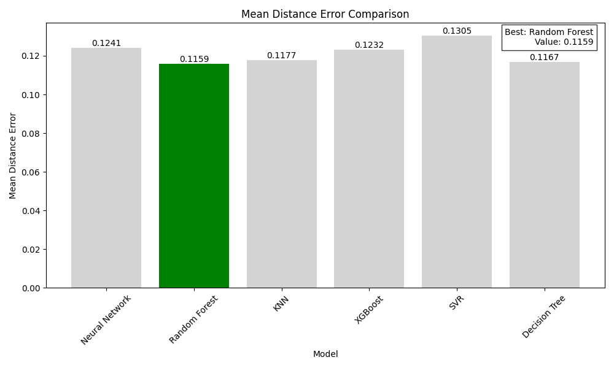
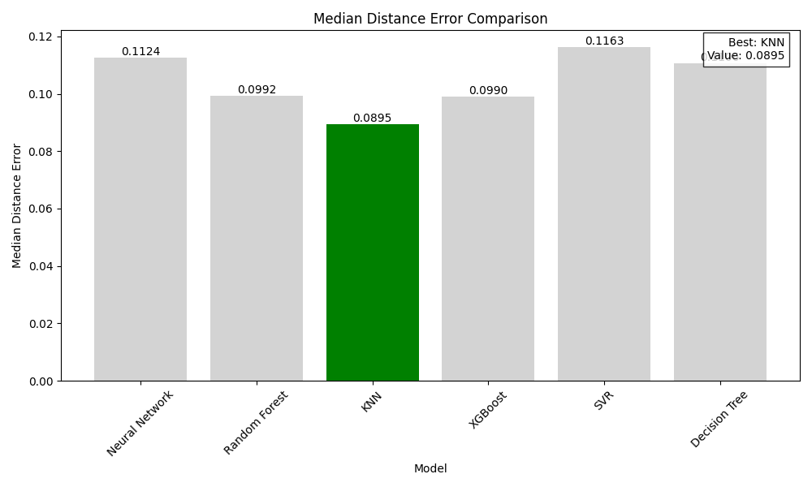
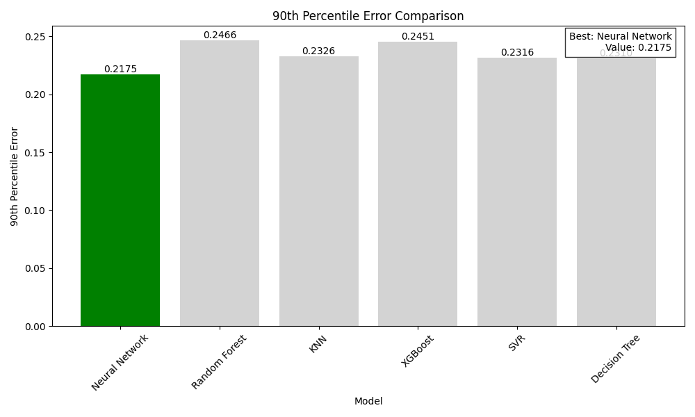
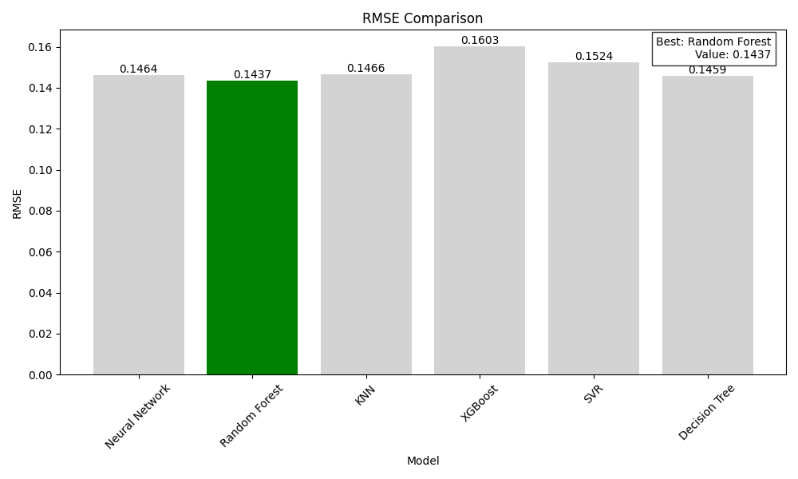
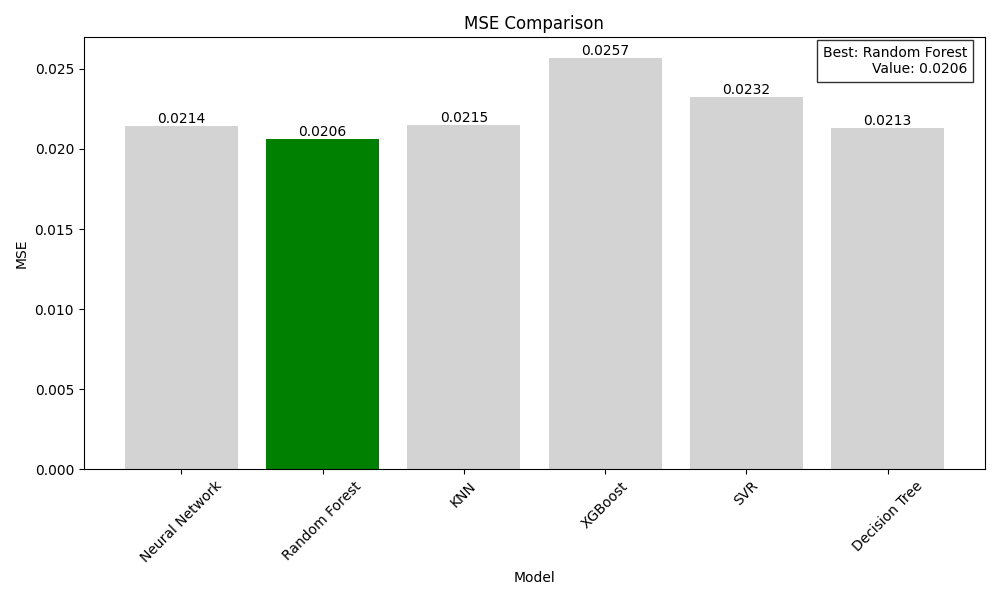
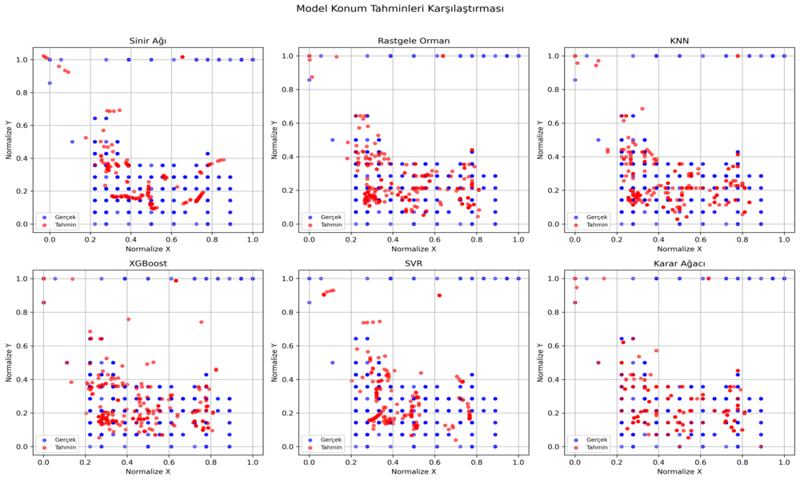
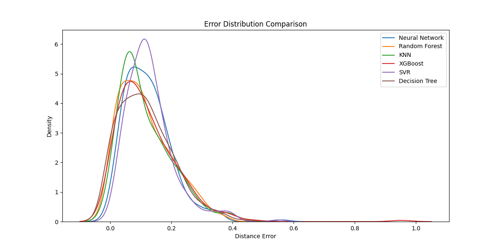
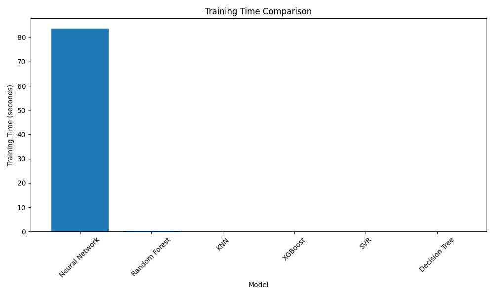

<style>
.page-break {
    page-break-before: always;
}
.keep-together {
    page-break-inside: avoid;
}
.center-image {
    text-align: center;
    margin: 30px auto;
    display: block;
    width: 90%;
}
img {
    display: block;
    margin: 0 auto;
    max-width: 90%;
    height: auto;
}
</style>

# iBeacon RSSI Verileri Kullanılarak İç Mekan Konum Tahmini: Makine Öğrenmesi Modellerinin Karşılaştırmalı Analizi

<div class="keep-together">
## Yönetici Özeti
Bu rapor, iBeacon RSSI (Alınan Sinyal Gücü Göstergesi) verilerini kullanarak iç mekan konum tahmini için çeşitli makine öğrenmesi modellerinin kapsamlı bir karşılaştırmasını sunmaktadır. Altı farklı modeli değerlendiriyoruz: Sinir Ağı, Rastgele Orman, K-En Yakın Komşular (KNN), XGBoost, Destek Vektör Regresyonu (SVR) ve Karar Ağacı.
</div>

<div class="page-break"></div>

<div class="keep-together">
## 1. Giriş
iBeacon teknolojisi kullanılarak iç mekan konum tahmini, çeşitli uygulamalar için giderek daha önemli hale gelmiştir. Bu çalışma, geleneksel modelleri derin öğrenme çözümüyle karşılaştırarak en etkili makine öğrenmesi yaklaşımını belirlemeyi amaçlamaktadır.
</div>

<div class="page-break"></div>

<div class="keep-together">
## 2. Metodoloji

### 2.1 Veri Seti
Çalışmamızda kullanılan veri seti, iç mekan konum tahmini için özel olarak toplanmış verilerden oluşmaktadır. Veri setimiz 1,420 etiketli örnek ve 5,191 etiketsiz örnek içermektedir. Her bir örnek, 13 farklı iBeacon'dan alınan RSSI okumasını içermektedir. Hedef değişkenlerimiz, [0,1] aralığında normalize edilmiş 2 boyutlu (x, y) koordinatlarıdır.

Aşağıda veri setinden seçilmiş örnek kayıtlar, farklı sinyal paternlerini göstermektedir:

```
location,b3001,b3002,b3003,b3004,b3005,b3006,b3007,b3008,b3009,b3010,b3011,b3012,b3013
K04,-200,-79,-72,-80,-200,-79,-200,-200,-200,-200,-200,-200,-200    # Çoklu aktif beacon örneği
I04,-200,-64,-200,-200,-200,-200,-200,-200,-200,-200,-200,-200,-200  # Güçlü sinyal örneği (-64 dBm)
K07,-200,-200,-200,-200,-75,-76,-200,-80,-200,-200,-200,-200,-200    # Üç aktif beacon örneği
L05,-200,-81,-78,-200,-77,-80,-200,-200,-200,-200,-200,-200,-200     # Farklı konumda sinyal dağılımı
```

Bu örneklerde görüldüğü gibi, -200 değeri kapsama alanı dışındaki beaconları, -60 ile -80 arası değerler ise farklı güçlerde alınan sinyalleri göstermektedir. Konum bilgisi (location), harf ve rakam kombinasyonuyla gösterilen grid koordinatlarını temsil etmektedir. Örnekler, veri setindeki sinyal çeşitliliğini ve mekansal dağılımı göstermektedir.

### 2.2 Veri Ön İşleme
Veri ön işleme aşamasında öncelikle eksik değerler ele alınmıştır. RSSI değerlerindeki -200 değerleri, kapsama alanı dışını temsil eden -150 değeri ile değiştirilmiştir. Ardından, tüm özellikler MinMaxScaler kullanılarak normalize edilmiştir. Konum bilgileri için kategorik koordinatlar LabelEncoder kullanılarak sayısal değerlere dönüştürülmüştür. Son olarak, veri seti tutarlı bir rastgele tohum kullanılarak %80 eğitim ve %20 test olarak ayrılmıştır.

### 2.3 Uygulanan Modeller
Çalışmamızda altı farklı model değerlendirilmiştir:
1. Sinir Ağı: Otokodlayıcı ön eğitimi ile Conv1D tabanlı mimari
2. Rastgele Orman: 100 tahminleyici ile optimize edilmiş model
3. KNN: k=5 komşu sayısı ile dengeli bir yaklaşım
4. XGBoost: Kare hata hedefli gradyan artırma tekniği
5. SVR: RBF çekirdeği ile regresyon analizi
6. Karar Ağacı: Maksimum derinlik 10 ile sınırlandırılmış model
</div>

<div class="page-break"></div>

<div class="keep-together">
## 3. Sonuçlar ve Analiz

### 3.1 Performans Metrikleri ve Temel Bulgular
Modellerin performans değerlendirmesi sonucunda, her bir modelin farklı metriklerde kendine özgü güçlü yönleri ortaya çıkmıştır. Kapsamlı analizlerimiz sonucunda, Rastgele Orman modelinin genel olarak en tutarlı performansı sergilediği görülmüştür. Bu model, 0.1159 değeri ile en düşük ortalama mesafe hatasını elde ederken, aynı zamanda 0.1437 RMSE ve 0.0206 MSE değerleri ile genel doğruluk açısından da en iyi sonuçları vermiştir. Bununla birlikte, KNN modeli özellikle medyan mesafe hatası konusunda başarılı olmuş ve 0.0895 değeri ile bu metrikte en iyi performansı göstermiştir. Öte yandan, Sinir Ağı modeli uç durumlardaki başarısıyla dikkat çekmiş ve 0.2175 değeri ile en düşük 90. yüzdelik hatayı elde etmiştir. Bu sonuçlar, her modelin belirli kullanım senaryolarında avantajlı olabileceğini göstermektedir.

<div class="center-image">

</div>
<div class="center-image">

</div>
<div class="center-image">

</div>
<div class="center-image">

</div>
<div class="center-image">

</div>
</div>

<div class="page-break"></div>

<div class="keep-together">
### 3.2 Konum Tahminleri ve Dağılım Analizi
<div class="center-image">

</div>

<div class="center-image">

</div>

Modellerin konum tahmin performansını görsel olarak değerlendirmek için iki farklı grafik kullanılmıştır. İlk grafikte, mavi noktalarla gösterilen gerçek konumlar ile kırmızı noktalarla işaretlenen tahmin edilen konumlar karşılaştırmalı olarak sunulmaktadır. Bu görselleştirme, her bir modelin mekansal tahmin doğruluğunu açıkça ortaya koymaktadır. İkinci grafik ise modellerin tahmin hatalarının dağılımını göstererek, performans tutarlılığını değerlendirmemize olanak sağlamaktadır.

Analiz sonuçlarına göre, Rastgele Orman modeli gerçek konumlara en yakın tahminleri üretmektedir. Bu model, özellikle farklı bölgelerdeki konumları tutarlı bir şekilde tahmin edebilmektedir. Sinir Ağı modeli de benzer şekilde güvenilir bir performans sergilemekte ve tahminlerinde istikrarlı bir pattern göstermektedir. KNN modeli, özellikle veri yoğunluğunun yüksek olduğu merkezi bölgelerde daha başarılı tahminler yaparken, XGBoost ve SVR modelleri birbirine benzer tahmin karakteristikleri göstermektedir. Karar Ağacı modeli ise diğer modellere kıyasla daha geniş bir tahmin dağılımına sahip olup, bu durum modelin bazı durumlarda daha yüksek tahmin belirsizliği gösterdiğine işaret etmektedir.
</div>

<div class="page-break"></div>

<div class="keep-together">
### 3.3 Hesaplama Verimliliği
<div class="center-image">

</div>
<div class="center-image">
.png)
</div>

Modellerin hesaplama verimliliği, eğitim ve çıkarım süreleri açısından detaylı bir şekilde incelenmiştir. Eğitim süreleri bakımından, geleneksel makine öğrenmesi modelleri önemli bir avantaj sergilemektedir. KNN modeli, 0.0014 saniyelik eğitim süresiyle en hızlı eğitilen model olarak öne çıkarken, Sinir Ağı modeli 81.52 saniye ile en uzun eğitim süresine sahiptir. Bu belirgin fark, modellerin yapısal karmaşıklıklarından kaynaklanmaktadır.

Çıkarım performansı açısından değerlendirildiğinde, Karar Ağacı modeli 0.0002 saniyelik çıkarım süresiyle en hızlı modeli oluşturmaktadır. Bunu diğer geleneksel modeller takip etmekte ve tümü milisaniyenin altında çıkarım süreleri sunmaktadır. Sinir Ağı modeli ise 0.2143 saniyelik çıkarım süresiyle en yavaş performansı göstermektedir. Bu sonuçlar, özellikle gerçek zamanlı uygulamalar için model seçiminde hesaplama verimliliğinin önemli bir kriter olduğunu vurgulamaktadır.
</div>

<div class="keep-together">
## 4. Tartışma

### 4.1 Model Değiş Tokuşları
Çalışmamızda incelenen modeller arasında önemli performans ve kaynak kullanımı farklılıkları gözlemlenmiştir. Sinir Ağı modeli, karmaşık yapısı ve derin öğrenme yaklaşımı sayesinde özellikle uç durumlarda tutarlı sonuçlar vermektedir. Ancak bu başarısı, yüksek hesaplama maliyeti ile gelmektedir. Model, 81.52 saniyelik eğitim süresi ve 0.2143 saniyelik çıkarım süresiyle en yavaş seçenek olarak öne çıkmaktadır.

Geleneksel modeller ise hesaplama verimliliği konusunda önemli avantajlar sunmaktadır. Bu modeller arasında Rastgele Orman, 0.1437 RMSE ve 0.0206 MSE değerleriyle en yüksek doğruluk seviyesine ulaşmıştır. Bununla birlikte, geleneksel modellerin bazı uç durumlarda hata oranlarının yükseldiği gözlemlenmiştir. Bu durum, model seçiminde uygulama gereksinimlerinin dikkatle değerlendirilmesi gerektiğini göstermektedir.

### 4.2 Öneriler
Farklı uygulama senaryoları için model seçimi yaparken, performans ve kaynak gereksinimleri arasında optimal denge kurulmalıdır. Gerçek zamanlı uygulamalar için Karar Ağacı ve KNN modelleri ideal seçenekler olarak öne çıkmaktadır. Bu modeller, hızlı çıkarım süreleri ve kabul edilebilir doğruluk seviyeleri sayesinde anlık konum tahmini gerektiren senaryolarda etkili çözümler sunmaktadır.

Hassas konum tahmini gerektiren ve işlem süresinin kritik olmadığı uygulamalarda Rastgele Orman modeli tercih edilmelidir. Bu model, en düşük RMSE ve MSE skorları ile tutarlı ve güvenilir sonuçlar üretmektedir. Özellikle yüksek doğruluk gerektiren endüstriyel uygulamalar ve hassas konumlandırma sistemleri için ideal bir seçenektir.

Sınırlı donanım kaynaklarına sahip sistemler için Karar Ağacı modeli önerilmektedir. Bu model, minimum hesaplama gereksinimleri ve makul doğruluk seviyesi ile kaynak kısıtlı ortamlarda optimal bir denge sağlamaktadır. Özellikle gömülü sistemler ve mobil cihazlar gibi sınırlı kaynaklara sahip platformlarda tercih edilmelidir.
</div>

<div class="page-break"></div>

<div class="keep-together">
## 5. Sonuç
Çalışmamız, iç mekan konum tahmini için farklı makine öğrenmesi yaklaşımlarının kapsamlı bir karşılaştırmasını sunmaktadır. Yapılan analizler sonucunda, her modelin kendine özgü güçlü yönleri ve kısıtlamaları olduğu görülmüştür. Sinir ağı yaklaşımı uç durumlarda daha başarılı sonuçlar verirken, geleneksel makine öğrenmesi modelleri yüksek hesaplama verimliliği ve rekabetçi doğruluk seviyeleri sunmaktadır. Bu nedenle, model seçimi yapılırken uygulamanın spesifik gereksinimleri, doğruluk beklentileri, hesaplama kaynakları ve çıkarım hızı gibi faktörler bir bütün olarak değerlendirilmelidir. Sonuç olarak, başarılı bir iç mekan konumlandırma sistemi için doğru model seçimi, uygulama özelindeki ihtiyaçlar ve kısıtlamalar göz önünde bulundurularak yapılmalıdır.

## Ek
Tam performans metrikleri ekteki [model_comparison_results.csv](model_comparison_results.csv) dosyasında mevcuttur.
</div>
